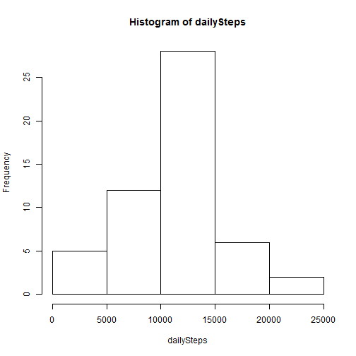
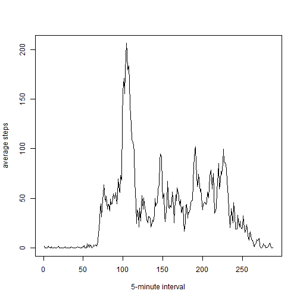
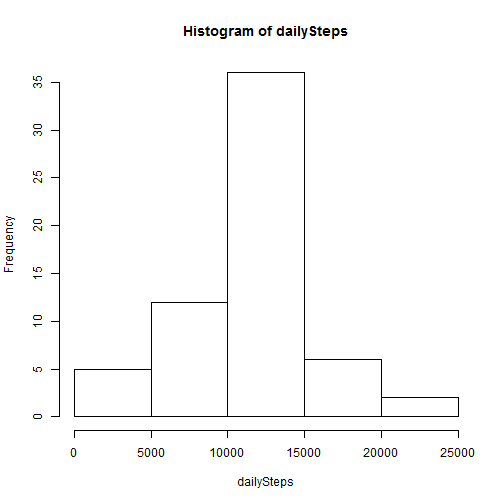

# Reproducible Research: Peer Assessment 1


## Loading and preprocessing the data
1. Unzip the activity.zip
2. Read the activity.csv to data frame - dat
3. Process/Transform the data


```r
dat <- read.csv(unz("activity.zip", "activity.csv"), header = T)
dat[, "date"] <- as.Date(dat[, "date"])
dat[, "date"] <- factor(dat[, "date"])
```


## What is mean total number of steps taken per day?
1. Make a histogram of the total number of steps taken each day  

```r
dailySteps <- tapply(dat[, "steps"], dat[, "date"], sum)
hist(dailySteps)
```

 

2. Calculate and report the mean and median total number of steps taken per day  

```r
meanOfSteps <- mean(dailySteps, na.rm = T)
medianOfSteps <- median(dailySteps, na.rm = T)
paste("The mean number of steps taken each day is:", meanOfSteps, ", and the median is:", 
    medianOfSteps)
```

```
## [1] "The mean number of steps taken each day is: 10766.1886792453 , and the median is: 10765"
```


## What is the average daily activity pattern?
1. Make a time series plot (i.e. type = "l") of the 5-minute interval (x-axis) and the average number of steps taken, averaged across all days (y-axis)  

```r
averageStepsPer5m <- tapply(dat[, "steps"], dat[, "interval"], mean, na.rm = T)
plot(averageStepsPer5m, type = "l", xlab = "5-minute interval", ylab = "average steps")
```

 


2. Which 5-minute interval, on average across all the days in the dataset, contains the maximum number of steps?

```r
max5MinuteInterval <- names(which.max(averageStepsPer5m))
maxNInterval <- which.max(averageStepsPer5m)
if (nchar(max5MinuteInterval) <= 2) {
    max5MinuteInterval <- paste("0:", max5MinuteInterval, sep = "")
} else if (nchar(max5MinuteInterval) == 3) {
    max5MinuteInterval <- paste(substr(max5MinuteInterval, 1, 1), ":", substr(max5MinuteInterval, 
        2, 3), sep = "")
} else {
    max5MinuteInterval <- paste(substr(max5MinuteInterval, 1, 2), ":", substr(max5MinuteInterval, 
        3, 4), sep = "")
}
maxAverageStepsPer5m <- max(averageStepsPer5m)
paste("I get the max number ", maxAverageStepsPer5m, " at ", maxNInterval, " intervals (", 
    max5MinuteInterval, ")", sep = "")
```

```
## [1] "I get the max number 206.169811320755 at 104 intervals (8:35)"
```


## Imputing missing values
1. Calculate and report the total number of missing values in the dataset (i.e. the total number of rows with NAs) 

```r
rowsAll <- nrow(dat)
rowsWithoutNA <- nrow(na.omit(dat))
paste("The total number of rows with NAs is", rowsAll - rowsWithoutNA)
```

```
## [1] "The total number of rows with NAs is 2304"
```

2. Fill in all of the missing values with the mean for that 5-minute interval.  
3. Create a new dataset that is equal to the original dataset but with the missing data filled in.

```r
datFilledInNAs <- dat
for (i in 1:nrow(dat)) {
    if (is.na(dat[i, 1])) {
        datFilledInNAs[i, 1] = averageStepsPer5m[as.character(dat[i, 3])]
    }
}
```

  
4. Make a histogram of the total number of steps taken each day and Calculate and report the mean and median total number of steps taken per day. 

```r
dailySteps <- tapply(datFilledInNAs[, "steps"], datFilledInNAs[, "date"], sum)
hist(dailySteps)
```

 

```r
meanOfSteps <- mean(dailySteps)
medianOfSteps <- median(dailySteps)
paste("The mean number of steps taken per day is:", meanOfSteps, ", and the median is:", 
    medianOfSteps, ". The median value differs from the estimates from the first part of the assignment. Imputing missing data slightly impacts on the median in this case.")
```

```
## [1] "The mean number of steps taken per day is: 10766.1886792453 , and the median is: 10766.1886792453 . The median value differs from the estimates from the first part of the assignment. Imputing missing data slightly impacts on the median in this case."
```


## Are there differences in activity patterns between weekdays and weekends?
1. Create a new factor variable in the dataset with two levels ¨C ¡°weekday¡± and ¡°weekend¡± indicating whether a given date is a weekday or weekend
day.

```r
Sys.setlocale("LC_TIME", "English")
```

```
## [1] "English_United States.1252"
```

```r
week <- weekdays(as.Date(datFilledInNAs[, 2]))
week[which(week %in% c("Saturday", "Sunday"))] = "weekend"
week[which(week %in% c("Monday", "Tuesday", "Wednesday", "Thursday", "Friday"))] = "weekday"
datFilledInNAs <- cbind(datFilledInNAs, week)
datFilledInNAs$week <- factor(datFilledInNAs$week)
```


2. Make a panel plot containing a time series plot of the 5-minute interval (x-axis) and the average number of steps taken, averaged across all weekday days or weekend days (y-axis).

```r
library(lattice)
averageStepsPer5m <- tapply(X = datFilledInNAs$steps, INDEX = list(datFilledInNAs$interval, 
    datFilledInNAs$week), mean)
weekdaySteps <- data.frame(averageStepsPer5m[, "weekday"])
names(weekdaySteps)[1] <- "steps"
weekdaySteps$week <- "weekday"
weekdaySteps$interval <- row.names(weekdaySteps)
weekendSteps <- data.frame(averageStepsPer5m[, "weekend"])
names(weekendSteps)[1] <- "steps"
weekendSteps$week <- "weekend"
weekendSteps$interval <- row.names(weekendSteps)
steps <- rbind(weekendSteps, weekdaySteps)
steps$interval <- as.integer(steps$interval)
xyplot(steps ~ interval | week, data = steps, layout = c(1, 2), type = "l")
```

 

